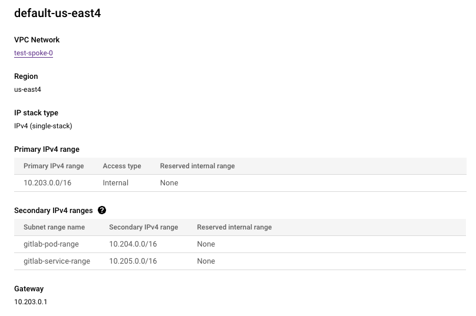
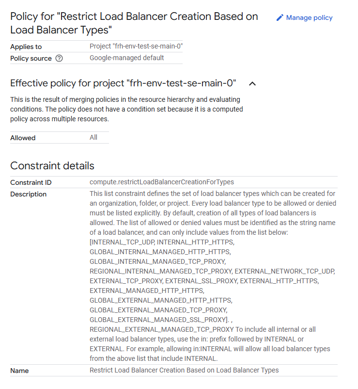
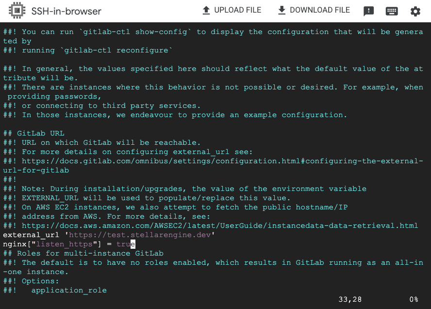

# GitLab Blueprint
This blueprint will deploy all the required infrastructure to host a GitLab instance that can support 40 RPS.

## Note
To have external access to the GitLab instance, the shared vpc networks in the Common Services folder need to be used for the GCE VM, GKE Cluster, and Load Balancer. To enable support for GKE clusters, manual steps to add the pods and service range to the network is required.

## Manual Pre-Requisite Steps
Go to the VPC Network inside of the net-host project inside of the Networking folder in the Stellar Engine environment.



Next, go to organization policies and change the Policy source to Google-managed default for the "Restrict Load Balancer Creation Based on Load Balancer Types" policy.



## Manual Post-Requisite Steps
Navigate to the deployed Load Balancer in Network Services on the Google Cloud Console. Note the Frontend IP and Port, this will be the URL of the deployed GitLab and be used when connecting the GKE cluster (e.g. http://127.0.0.1:80). Run the following commands in order on the deployed virtual machine via SSH.
```bash
gcloud container clusters get-credentials <CLUSTER_NAME> --region=CLUSTER_LOCATION --project <PROJECT_ID>
```
```bash
kubectl apply -f https://github.com/jetstack/cert-manager/releases/download/v1.7.1/cert-manager.yaml
```
```bash
curl --silent --location "https://github.com/operator-framework/operator-lifecycle-manager/releases/download/v0.24.0/install.sh" \ | bash -s v0.24.0
```
```bash
kubectl create -f https://operatorhub.io/install/gitlab-runner-operator.yaml
```
```bash
cat > certificate-issuer-install.yaml << EOF
apiVersion: v1
kind: Namespace
metadata:
  labels:
    app.kubernetes.io/component: controller-manager
    app.kubernetes.io/managed-by: olm
    app.kubernetes.io/name: gitlab-runner-operator
  name: gitlab-runner-system
---
apiVersion: cert-manager.io/v1
kind: Certificate
metadata:
  name: gitlab-runner-serving-cert
  namespace: gitlab-runner-system
spec:
  dnsNames:
  - gitlab-runner-webhook-service.gitlab-runner-system.svc
  - gitlab-runner-webhook-service.gitlab-runner-system.svc.cluster.local
  issuerRef:
    kind: Issuer
    name: gitlab-runner-selfsigned-issuer
  secretName: webhook-server-cert
---
apiVersion: cert-manager.io/v1
kind: Issuer
metadata:
  name: gitlab-runner-selfsigned-issuer
  namespace: gitlab-runner-system
spec:
  selfSigned: {}
EOF
```
```bash
kubectl create -f certificate-issuer-install.yaml
```
In the SSH connection run the following command to get admin credentials.
```bash
sudo cat /etc/gitlab/initial_root_password | grep "^Password: "
```
Navigate to your deployed GitLab instance in your browser and login as root.
Navigate to Admin Page -> CI/CD -> Runners -> New instance runner.
Choose the Linux operating system option.
Note the runner's authentication token.
```bash
cat > gitlab-runner-secret.yml << EOF
apiVersion: v1
kind: Secret
metadata:
  name: gitlab-runner-secret
type: Opaque
stringData:
  runner-token: YOUR_RUNNER_AUTHENTICATION_TOKEN
EOF
```
Before moving onto this step you have to wait about 30 minutes for the earlier changes to have been applied to the cluster. The GitLab OLM runner is installing on the clusters. There will be no visual indication when the process is done.
```bash
kubectl apply -f gitlab-runner-secret.yml
```
```bash
cat > gitlab-runner.yml << EOF
apiVersion: apps.gitlab.com/v1beta2
kind: Runner
metadata:
  name: gitlab-runner
spec:
  gitlabUrl: <your gitlab url here (e.g. http://127.0.0.1)>
  buildImage: alpine
  token: gitlab-runner-secret
EOF
```
```bash
kubectl apply -f gitlab-runner.yml
```

## Enabling HTTPS
To enable HTTPS on the GitLab instance it requires a ssl certificate and a registry to validate the certificate before you enable HTTPS on the VM. This deployed GitLab can support HTTPS and to do so follow these steps.
SSH into the GitLab VM.
```bash 
sudo vim /etc/gitlab/gitlab.rb
```
Change the external url to be https instead of http and add the following line:
- nginx["listen_https"] = true

It will look like this:



Run the command to reconfigure GitLab
```bash
sudo gitlab-ctl reconfigure
```
Note, this will autocreate certificates in /etc/gitlab/ssl; however, you will not need to use these.

Reconfigure the GitLab Runners to connect with the HTTPS URL instead.
```bash
cat > gitlab-runner.yml << EOF
apiVersion: apps.gitlab.com/v1beta2
kind: Runner
metadata:
  name: gitlab-runner
spec:
  gitlabUrl: <your gitlab url here (e.g. https://your.gitlab.com)>
  buildImage: alpine
  token: gitlab-runner-secret
EOF
```
```bash
kubectl apply -f gitlab-runner.yml
```
Navigate to the deployed load balancer and change the front end to HTTPS and add your certificate.

The setup should now be complete and GitLab will now have HTTPS enabled.
<!-- BEGIN TFDOC -->
## Variables

| name | description | type | required | default |
|---|---|:---:|:---:|:---:|
| [gitlab_uri](variables.tf#L1) | The URL hostname that the gitlab instance will be attached to. | <code>string</code> | ✓ |  |
| [kms_key](variables.tf#L24) | KMS key path. | <code>string</code> | ✓ |  |
| [net_project](variables.tf#L35) | Project name of the spoke network. This project has the Stellar Engine deployed default VPC and is in the Networking folder. | <code>string</code> | ✓ |  |
| [network](variables.tf#L40) | Network path to use for cluster, VM, and load balancer. | <code>string</code> | ✓ |  |
| [network_name](variables.tf#L45) | Network name to use for Firewall rules. E.G. test-net-spoke. | <code>string</code> | ✓ |  |
| [nodepool_node_count](variables.tf#L50) | Number of node per zone in the Nodepool. | <code title="object&#40;&#123;&#10;  current &#61; optional&#40;number&#41;&#10;  initial &#61; number&#10;&#125;&#41;">object&#40;&#123;&#8230;&#125;&#41;</code> | ✓ |  |
| [project_id](variables.tf#L59) | Project ID where the GitLab cluster, VM, and load balancer will be deployed to. | <code>string</code> | ✓ |  |
| [sa](variables.tf#L70) | Service account to run GKE and VM. | <code>string</code> | ✓ |  |
| [subnetwork](variables.tf#L75) | Subnet path to use for cluster, VM, and load balancer. | <code>string</code> | ✓ |  |
| [gke_initial_node_per_zone](variables.tf#L6) | Initial node amount per zone. | <code>number</code> |  | <code>1</code> |
| [gke_name](variables.tf#L12) | Name of the GKE cluster. | <code>string</code> |  | <code>&#34;gitlab-cluster&#34;</code> |
| [instance_name](variables.tf#L18) | Name of the vm. | <code>string</code> |  | <code>&#34;gitlab-instance&#34;</code> |
| [lb_name](variables.tf#L29) | Application load balancer name. | <code>string</code> |  | <code>&#34;gitlab-load-balancer&#34;</code> |
| [region](variables.tf#L64) | Region for deployment. | <code>string</code> |  | <code>&#34;us-east4&#34;</code> |
| [vm_name](variables.tf#L80) | VM name. | <code>string</code> |  | <code>&#34;gitlab-vm&#34;</code> |
| [zone](variables.tf#L86) | Zone to deploy to. | <code>string</code> |  | <code>&#34;us-east4-a&#34;</code> |

## Outputs

| name | description | sensitive |
|---|---|:---:|
| [gke-cluster](outputs.tf#L1) | Deployed GKE cluster. | ✓ |
| [lb](outputs.tf#L7) | Application Load Balancer. | ✓ |
| [umig](outputs.tf#L13) | Unmanaged instance group. | ✓ |
| [vm](outputs.tf#L19) | Deployed VM. | ✓ |
<!-- END TFDOC -->
